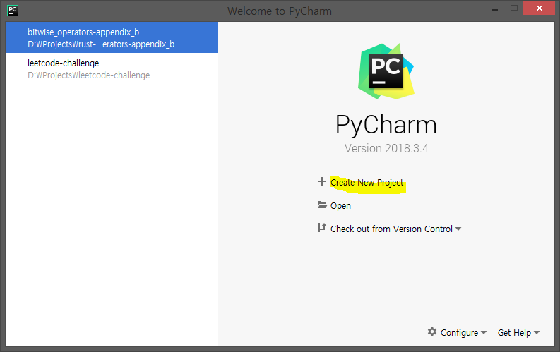
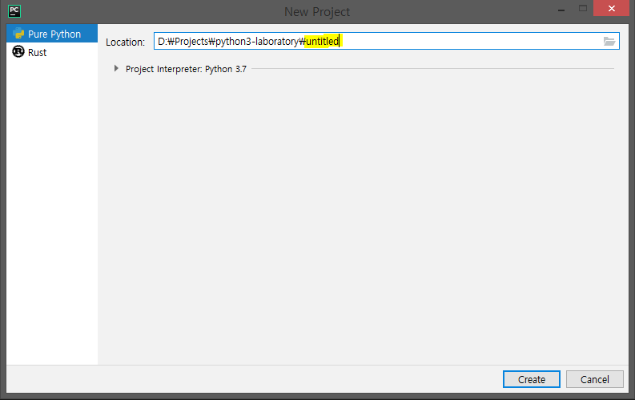
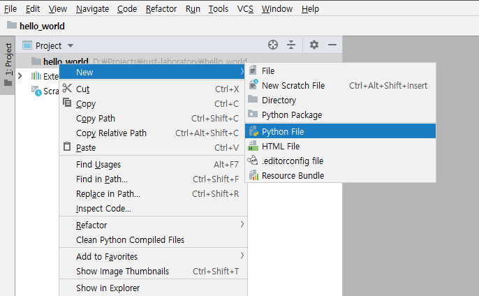
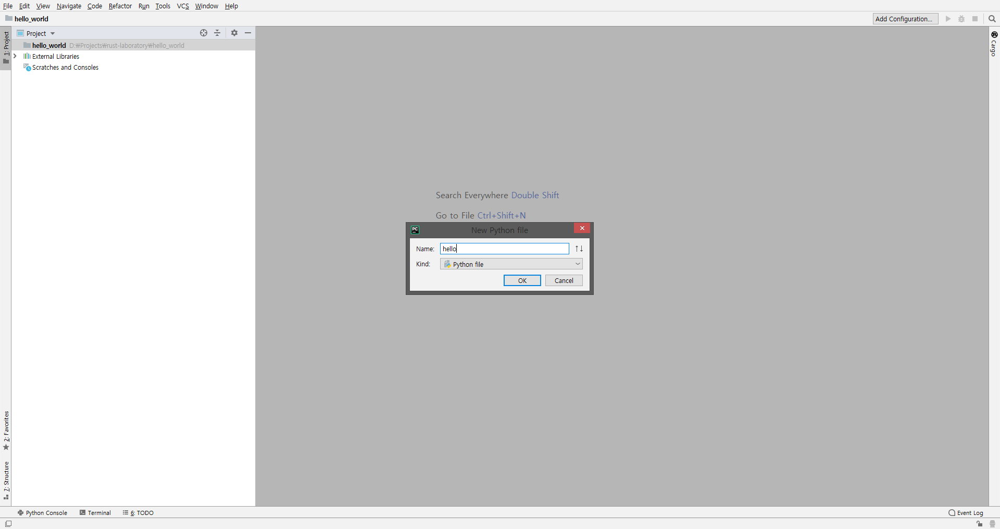
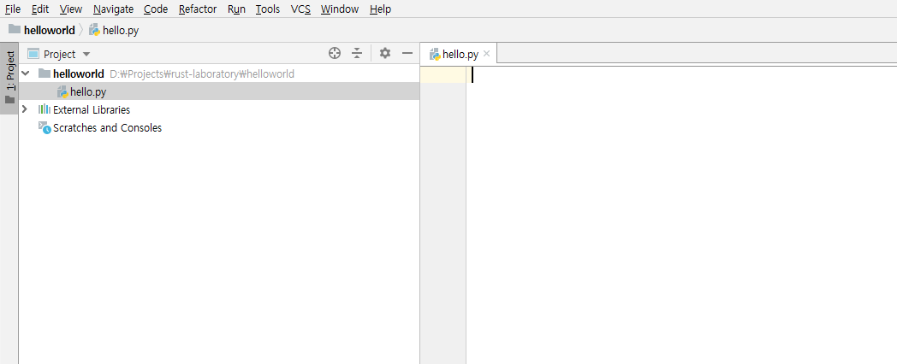
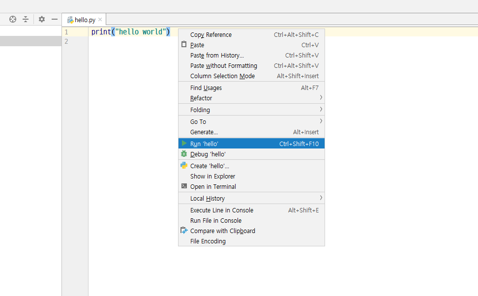

# 첫 번째 프로그램 만들기

이제 `hello world`라는 문자열을 화면에 표시하는 파이썬 프로그램을 만들어 보면서, 프로그램의 기본 작성 방법, 저장 방법과 실행 방법을 알아보겠습니다.

파이썬 프로그램은 파이썬 인터프리터로 실행하거나 소스 코드에서 바로 실행할 수 있습니다.

## 파이썬 인터프리터로 프로그램 실행하기

Windows에서는 `명령 프롬프트`, Mac OS X나 GNU/Linux에서는 `터미널` 또는 `gnome-terminal`을 실행한 다음, `python3`을 실행하고 `[enter]` 키를 누릅니다. (이전 장 `[파이썬 설치하기](./installation.md#installation)`를 참고하세요)

파이썬을 실행하면, 까만 창에 `>>>`가 보이고 `>>>` 뒤부터 소스 코드를 입력할 수 있을 것입니다. 이것을 _파이썬 인터프리터_이라고 부릅니다.

이제 아래의 코드를 입력하고 `[enter]` 키를 눌러 봅시다.

```python
print("hello world")
```

`hello world`라는 글자가 화면에 표시되는 것을 확인할 수 있습니다.

Mac OS X에서는 실행 결과가 아래와 같이 보일 것입니다. 화면에 나오는 파이썬 버전은 설치된 파이썬 버전에 따라 아래와 다르게 보일 수도 있지만, `>>>` 뒤의 부분은 동일하게 표시될 것입니다.

<!-- The output should match pythonVersion variable in book.json -->
```python
$ python3
Python 3.6.0 (default, Jan 12 2017, 11:26:36)
[GCC 4.2.1 Compatible Apple LLVM 8.0.0 (clang-800.0.38)] on darwin
Type "help", "copyright", "credits" or "license" for more information.
>>> print("hello world")
hello world
```

파이썬이 프로그램의 실행 결과를 바로 보여주는 것을 확인할 수 있습니다! 방금 입력한 것을 하나의 파이썬 _문장_이라고 하는데, 여기서 `print`는 소괄호 안에 주어진 값을 화면에 출력하는 역할을 합니다. 이 프로그램에서는 `hello world`라는 문자열을 `print`에 전달하여, 화면에 그 내용을 출력합니다.

### 파이썬 인터프리터 종료하기

GNU/Linux나 OS X의 `터미널`을 사용하고 있다면, `[ctrl + d]` 키를 누르거나 `exit()`(`exit` 뒤의 `()`까지 빠짐없이 입력하세요)을 입력하고 `[enter]` 키를 눌러 파이썬 인터프리터를 종료할 수 있습니다.

Windows의 `명령 프롬프트`에서는 `[ctrl + z]` 키를 누른 다음, `[enter]` 키를 누르면 파이썬 인터프리터가 종료됩니다.

## 텍스트 편집기 또는 통합 개발 환경 (IDE, Integrated Development Environment) 선택하기

프로그램을 실행할 때마다 소스 코드를 매번 인터프리터에 입력하는 대신, 소스 코드를 파일에 저장하면 필요할 때마다 프로그램을 편리하게 실행할 수 있습니다.

파이썬 소스 파일을 만들기 위해서는 텍스트를 입력하고 저장할 수 있는 편집기 소프트웨어가 필요합니다. 어떤 텍스트 편집기를 사용하느냐에 따라 소스 코드를 얼마나 편리하게 작성할 수 있는지가 달라지기 때문에, 좋은 텍스트 편집기를 선택하는 것은 매우 중요합니다. 자동차 한 대를 구입한다는 마음으로 텍스트 편집기를 선택해보세요. 좋은 텍스트 편집기를 사용하면 파이썬 코드를 더 쉽고 편하게 작성할 수 있으며, 정해진 목표를 빠르게 달성할 수도 있습니다. 

좋은 텍스트 편집기의 요구 조건 중 하나는 _구문 강조 기능 (syntax highlighting)_으로, 이것은 프로그램을 작성할 때 사용되는 키워드의 색깔을 다르게 표시해서 소스 코드를 눈으로 이해할 수 있게 도와주는 기능입니다.

좋은 텍스트 편집기를 찾는 게 너무 어렵다고요? 제가 추천하는 소프트웨어는 [PyCharm 교육용 버전](https://www.jetbrains.com/pycharm-edu/)인데, Windows, Mac OS X와 GNU/Linux 운영 체제를 지원합니다. PyCharm에 대한 자세한 내용은 그 다음 문단에서 다루도록 하겠습니다.

Windows 운영 체제를 사용하고 있다면, *제발 메모장은 사용하지 말아주세요*. 프로그램을 작성할 때 메모장을 사용하는 것이 좋지 않은 이유는 좋은 텍스트 편집기들과 달리 메모장에는 구문 강조 기능이 없으며 들여쓰기를 제대로 할 수 없기 때문입니다. 파이썬에서 소스 코드의 들여쓰기가 무엇이고 왜 중요한지에 대해서는 나중에 배우도록 하겠습니다.

GNU/Linux 운영 체제에서 프로그램을 짜본 경험이 있다면, [Vim](http://www.vim.org)이나 [Emacs](http://www.gnu.org/software/emacs/) 같은 텍스트 편집기를 써본 적이 있을 겁니다. Vim과 Emacs는 GNU/Linux 환경에서 상당히 좋은 텍스트 편집기로, 파이썬 프로그램을 편리하게 작성하는 데에 도움을 줄 수 있습니다. 저는 개인적으로 Vim과 Emacs를 둘 다 사용하는데, 특히 Vim은 [Vim 사용법에 대한 책]({{ book.vimBookUrl }})도 하나 쓴 적이 있죠!

혹시 Vim이나 Emacs를 배울 생각이 있으시다면, 나중에 도움이 많이 되기 때문에 꼭 둘 중에 하나를 배우시는 것을 추천합니다. 그렇지만 아까 말했듯이 파이썬을 처음 배우시는 분들이라면 PyCharm으로 프로그램을 작성하면서 파이썬의 기본기를 다진 후에 Vim이나 Emacs 사용법을 배우는 것도 괜찮습니다.

다시 말하지만, 좋은 텍스트 편집기를 사용하면 파이썬 프로그램을 더 쉽고 재미있게 작성할 수 있다는 것을 꼭 기억하시기 바랍니다.

## PyCharm으로 파이썬 프로그램 만들기 {#pycharm}

[PyCharm 커뮤니티 에디션](https://www.jetbrains.com/pycharm/download/#section=windows)은 파이썬 프로그램을 편리하게 작성할 수 있게 도와주는 IDE로, 간단한 사용법은 다음과 같습니다.

먼저, PyCharm을 실행하고, `Create New Project`를 클릭하세요.



여기서 `Pure Python`을 선택한 다음, `untitled`라고 되어있는 부분을 `helloworld`로 바꾸고 `Create` 버튼을 클릭하세요.



이제 `helloworld` 폴더를 오른쪽 클릭한 다음, `New` -> `Python File`을 선택하세요.



새 파이썬 파일 이름을 지정하라는 창이 뜨면 `hello`를 입력하세요.



새 파이썬 파일이 만들어진 것을 확인할 수 있습니다.



이제 아래의 코드를 그대로 입력하세요.

<!-- TODO: Update screenshots for Python 3 -->

```python
print("hello world")
```
작성한 코드를 전체 선택하고, 오른쪽 클릭한 다음 메뉴에서 `Run 'hello'`를 클릭하세요.



아래와 같이 프로그램이 `hello world`를 출력하는 것을 확인할 수 있습니다.


PyCharm의 자세한 사용법에 대해 더 알고 싶다면 [PyCharm 퀵 스타트 가이드](https://www.jetbrains.com/help/pycharm/quick-start-guide.html) 페이지를 확인해 보시기 바랍니다.

## Vim 설치하기

1. 먼저 [Vim](http://www.vim.org)을 설치하세요.
    * Mac OS X를 사용하시는 경우, [HomeBrew](http://brew.sh/)로 `macvim`을 설치하세요.
    * Windows를 사용하시는 경우, [Vim 웹사이트](http://www.vim.org/download.php)에서 설치 파일을 다운로드하실 수 있습니다.
    * GNU/Linux를 사용하시는 경우, 리눅스 배포판의 소프트웨어 저장소에서 Vim을 다운로드하세요. 
2. 자동 완성 기능을 사용하기 위해 [jedi-vim](https://github.com/davidhalter/jedi-vim) 플러그인을 설치하세요.
3. `명령 프롬프트`나 `터미널`에서 `pip install -U jedi`를 입력하여 `jedi` 파이썬 패키지를 설치하세요.

## Emacs 설치하기

1. 먼저 [Emacs 24 이상의 버전](http://www.gnu.org/software/emacs/)을 설치하세요.
    * Mac OS X를 사용하시는 경우, http://emacsformacosx.com에서 설치 파일을 다운로드하세요.
    * Windows를 사용하시는 경우, http://ftp.gnu.org/gnu/emacs/windows/에서 설치 파일을 다운로드하실 수 있습니다.
    * GNU/Linux를 사용하시는 경우, 리눅스 배포판의 소프트웨어 저장소에서 Emacs를 다운로드하세요.
2. 자동 완성 기능을 사용하기 위해 [ELPY](https://github.com/jorgenschaefer/elpy/wiki) Emacs 패키지를 설치하세요.

## 소스 코드로 프로그램 실행하기

좋은 텍스트 편집기도 설치했으니 다시 프로그래밍에 대한 설명을 이어가도록 하겠습니다. 프로그래밍 세계에서는 한 가지 유명한 전통이 있는데, 바로 프로그래밍 언어를 배울 때는 'hello world'를 화면에 출력하는 프로그램을 제일 먼저 만들어 보아야 한다는 것입니다.  유명한 Perl 프로그래머인 사이먼 코젠스[^1]는 이 프로그램에 대해 "외우는 순간 프로그래밍의 신들이 나타나 프로그래밍 언어를 제대로 배울 수 있게 도와주는, 유서 깊은 마법의 주문"라고 말하기도 했습니다.

텍스트 편집기를 실행하고, 아래의 프로그램을 작성하여 `hello.py`라는 이름으로 저장하세요.

```python
print("hello world")
```

프로그램을 어디에 저장해야 할지 모르시겠다고요? 폴더의 위치를 정확히 알고 계신다면, 어느 폴더에 저장하든지 상관은 없습니다. 혹시 프로그램을 어느 폴더에 저장해야 할지 아직도 고민하고 계시다면, 여기에 저장하시는 것도 괜찮을 것 같네요!

- Mac OS X: `/tmp/py`
- GNU/Linux: `/tmp/py`
- Windows: `C:\py`

새 폴더를 만들려면, `명령 프롬프트`나 `터미널`에서 `mkdir` 명령어를 사용하시면 됩니다. (예시: `mkdir /tmp/py`)

프로그램을 저장할 때는 `foo.py`처럼 **반드시 파일 확장자가 `.py`인지 확인**해주세요.

이제 파이썬 프로그램을 실행해보도록 하겠습니다.

1. `명령 프롬프트` 또는 `터미널` 창을 실행하세요. (어떻게 실행하는지 기억이 잘 안 나신다면, [파이썬 설치하기](./installation.md) 장을 참고해주세요)
2. `cd /tmp/py`와 같이, `cd` (**c**hange **d**irectory) 명령어를 사용해서 프로그램이 저장되어 있는 위치로 이동하세요.
3. `명령 프롬프트` 또는 `터미널` 창에 `python hello.py`를 입력하세요. 프로그램의 실행 결과는 아래와 같습니다.

```
$ python hello.py
hello world
```


If you got the output as shown above, congratulations! - you have successfully run your first Python program. You have successfully crossed the hardest part of learning programming, which is, getting started with your first program!

In case you got an error, please type the above program _exactly_ as shown above and run the program again. Note that Python is case-sensitive i.e. `print` is not the same as `Print` - note the lowercase `p` in the former and the uppercase `P` in the latter. Also, ensure there are no spaces or tabs before the first character in each line - we will see [why this is important](./basics.md#indentation) later.

**프로그램 설명**

파이썬 프로그램은 여러 개의 _문장 (statement)_로 이루어져 있습니다. 방금 작성한 프로그램은 하나의 문장으로 이루어져 있는데, 이 `print` _문장_은 텍스트 "hello world"를 받아서 화면에 출력하는 기능을 수행합니다.

## 도움말 보기

파이썬에서 함수나 문장에 대한 설명을 빠르게 확인하고 싶을 때는, 파이썬에 내장된 `help` 기능을 사용할 수 있습니다. 이 기능은 파이썬 인터프리터를 사용하고 있을 때 특히 유용한 기능입니다. 예를 들어, 파이썬 인터프리터에서 `help('len')`를 입력하면 원소의 개수를 세는 `len` 함수에 대한 도움말을 읽을 수 있으며,  `q`를 입력하면 도움말 화면을 닫을 수 있습니다. 또한, 파이썬 인터프리터에서 `help()`를 입력하면 `help` 기능 자체에 대한 정보도 확인할 수 있습니다.

`help` 기능을 사용할 때는 `help('return')`처럼 괄호 안의 내용을 반드시 따옴표로 감싸야 한다는 것에 주의하시기 바랍니다.

## 정리

이번 장에서는 파이썬 프로그램의 기본 작성 방법, 저장 방법과 실행 방법을 알아보았습니다.

이제 파이썬의 기본기를 다져보도록 합시다.

---

[^1]: the author of the amazing 'Beginning Perl' book
