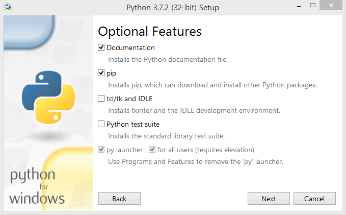
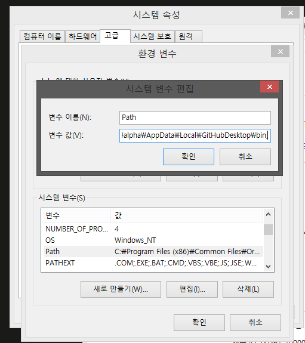
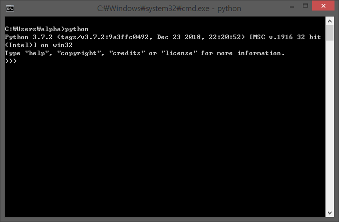

# 파이썬 설치하기 {#installation}

이제부터 이 책에서 "파이썬 3"은 [파이썬 3.6.0](https://www.python.org/downloads/) 이상의 모든 파이썬 버전을 가리키는 것으로 하겠습니다.

## Windows에서 파이썬 설치하기

파이썬 공식 홈페이지의 [다운로드 페이지](https://www.python.org/downloads/)에 들어가서 최신 버전 (2019-02-24 기준 3.7.2)을 다운로드한 다음, 설치 파일을 더블 클릭하여 파이썬을 설치하세요.

Windows Vista 이하의 버전을 사용하고 계시다면, Windows Vista 이하 버전을 지원하는 마지막 파이썬 버전인 [파이썬 3.4](https://www.python.org/downloads/windows/)를 다운로드하셔야 합니다.


파이썬을 설치하기 전에 `Add Python 3.7 to PATH` 옵션이 체크되어 있는지 반드시 확인하세요.

파이썬을 다른 곳에 설치하려면 `Customize installation`을 클릭하고, `Next` 버튼을 누른 다음 `Customize install location` 아래 칸에 `C:\python37`같이 새로운 설치 경로를 입력해줍니다.


`Add Python 3.7 PATH` 옵션을 깜박하고 체크하지 않으셨다면, 여기서 `Add Python to environment variables`을 체크해주세요. `Add Python 3.7 to PATH`과 똑같은 기능을 제공합니다.



`모든 사용자를 위해 (for all users) py launcher 설치` 옵션은 선택하지 않아도 상관없습니다. `py launcher`는 주로 다른 파이썬 버전 (파이썬 2.x 등)을 실행하기 위해 사용됩니다.

`Add Python 3.7 PATH`나 `Add Python to environment variables` 옵션을 체크하고 설치했는데 파이썬 설치 경로가 제대로 설정되지 않았다면, 바로 밑의 `명령 프롬프트`에 있는 내용을 차근차근 따라하도록 합니다. 설치 경로가 제대로 설정되었다면 이 페이지 아래로 내려가 `Windows에서 파이썬 실행하기`의 내용을 읽어보세요.

참고: Docker를 많이 사용해보셨다면 [Docker용 파이썬 이미지](https://hub.docker.com/_/python/)와 [Windows에서 Docker를 사용하는 방법](https://docs.docker.com/windows/)을 확인해 보세요.

### 명령 프롬프트 {#dos-prompt}

`명령 프롬프트` 등의 Windows CLI (Command-Line Interface) 환경에서 파이썬을 사용하고자 한다면, `PATH` 환경 변수를 제대로 설정해야 합니다.

Windows 7과 8.1을 사용하고 계시다면 아래의 과정을 그대로 따라해주세요.

- Windows 7에서는 `시작 버튼`을 클릭, Windows 8.1에서는 `시작 버튼`을 오른쪽 클릭한 다음, `제어판 -> 시스템`에 들어가세요. Windows 10에서는 `시작 버튼`을 클릭해 시작 메뉴를 열고 `설정 -> 시스템 -> 시스템 정보`로 들어가시면 됩니다. 시스템 정보 화면의 왼쪽에 있는 `고급 시스템 설정` 버튼을 클릭한 다음, `고급` 탭으로 들어가세요. 그 다음에는, 탭의 아래에 있는 `환경 변수`를 클릭하고 `시스템 변수` 목록에 있는 `PATH` 환경 변수를 찾아 `편집`을 클릭하세요.



- `변수 값`의 맨 오른쪽에 `;C:\Python37`를 추가해주세요. 파이썬 버전에 따라 폴더 이름은 조금씩 다를 수 있습니다.
- `확인` 버튼을 클릭하여 환경 변수 설정을 저장하고, 명령 프롬프트를 다시 실행해주세요.

### Windows에서 파이썬 실행하기

[`PATH` 환경 변수](#dos-prompt)를 제대로 설정했다면 명령 프롬프트에서 파이썬 인터프리터를 실행할 수 있습니다.

명령 프롬프트를 실행하려면, 시작 버튼을 오른쪽 클릭하고 `실행(R)`을 클릭하세요. 실행 창이 뜨면 `cmd`를 입력하고 `[enter]` 키를 눌러 주세요.



명령 프롬프트가 보이면 `python`를 입력해 제대로 파이썬이 설치되었는지 확인하세요.

## Mac OS X에서 파이썬 설치하기

Mac OS X를 사용하고 계신다면, [Homebrew](http://brew.sh)를 사용해주세요. 터미널 창에 `brew install python3`를 입력하시면 파이썬이 설치됩니다.

설치가 제대로 되었는지 확인하려면 `[Command + Space]` 키를 눌러 Spotlight 검색창을 실행하고, `터미널`을 입력한 다음 `[enter]` 키를 눌러 주세요. 터미널이 보이면 `python3`을 실행해 제대로 파이썬이 설치되었는지 확인하세요.

## GNU/Linux에서 파이썬 설치하기

GNU/Linux를 사용하고 계시다면, 패키지 관리 시스템을 사용해 파이썬을 설치하세요. 예를 들어, Debian과 Ubuntu에서는 `sudo apt-get update && sudo apt-get install python3`를 실행하면 파이썬이 설치됩니다.

설치가 제대로 되었는지 확인하려면 `터미널`을 실행하거나 `Alt + F2` 키를 누르고 `gnome-terminal`을 실행한 다음, `python3`을 입력하고 `[enter]` 키를 누른 다음 제대로 파이썬이 설치되었는지 확인하세요.

`python3 -V` 명령어를 사용해서 설치된 파이썬 버전을 확인해볼 수 있습니다.

<!-- The output should match pythonVersion variable in book.json -->
```
$ python3 -V
Python 3.7.2
```

설치된 리눅스 배포판이나 파이썬 버전에 따라, 위의 내용은 조금씩 다르게 보일 수도 있습니다.

## 정리

이제 파이썬 3 설치가 모두 끝났습니다. 다음 장에서는 첫 번째 파이썬 프로그램을 만들어 보겠습니다.
